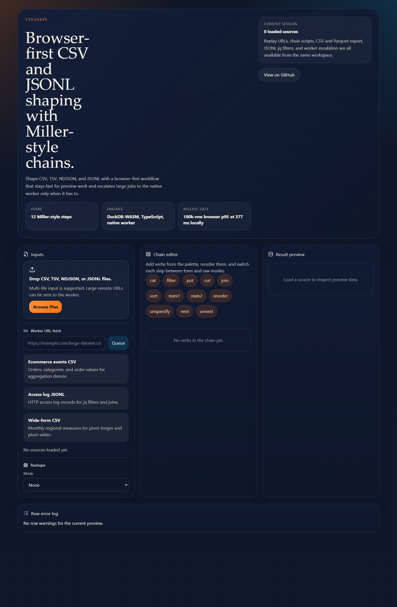
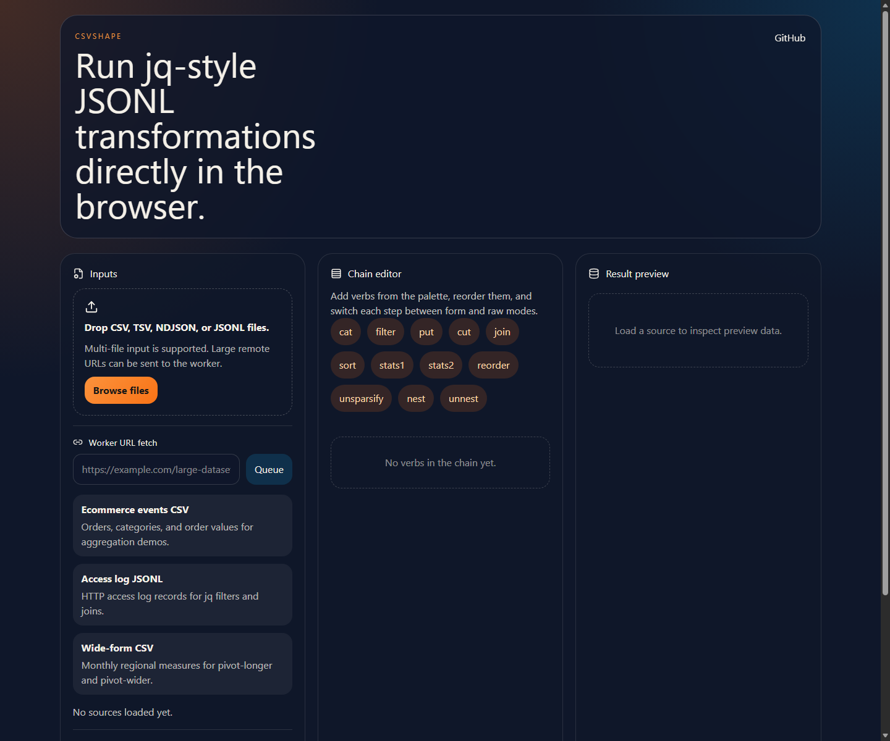
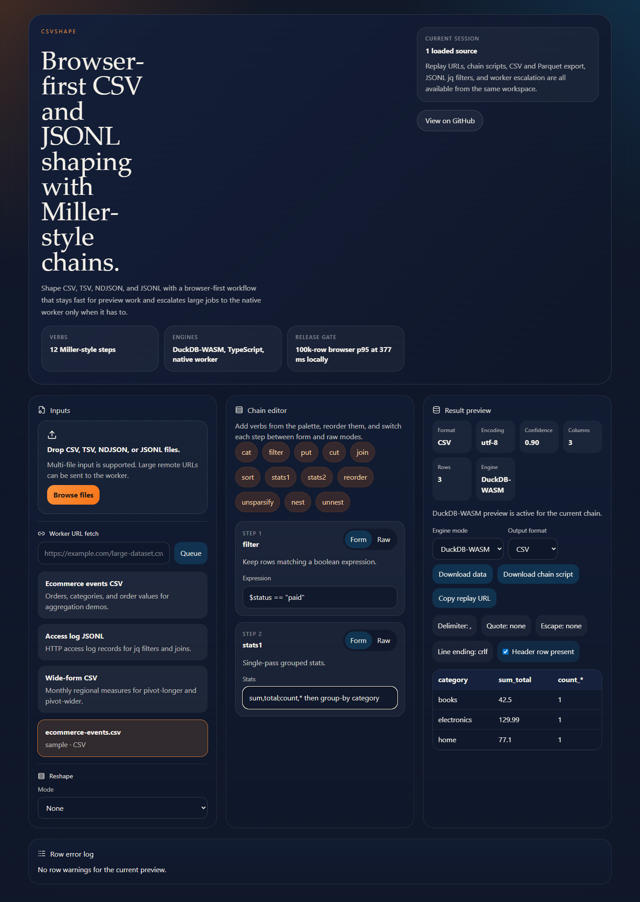

# CSVShape

CSVShape stream-processes CSV, TSV, NDJSON, and JSONL in your browser with Miller-style verb chains, joins, pivots, and dialect sniffing. The browser path currently uses DuckDB-WASM plus a TypeScript preview executor, and large files can escalate to a native worker path.

Hosted web app: `https://chayprabs.github.io/csv-jsonl-miller/`

## UI Preview

Homepage:



JSONL tools route:



DuckDB-WASM preview on a supported browser chain:



## Workspace

- `packages/core`: core types, execution planning, format sniffing, and shared fixtures.
- `packages/web`: Vite + React playground.
- `apps/worker`: Hono worker for large-file and native-tool execution.

## Route Entry Points

- `/`
- `/csv-filter-online/`
- `/csv-join-online/`
- `/csv-pivot-online/`
- `/jsonl-tools/`
- `/miller-online/`

## Development

```bash
pnpm install
pnpm dev
pnpm dev:worker
pnpm lint
pnpm typecheck
pnpm test
pnpm build
pnpm bench:browser
pnpm bench:worker
pnpm audit:lighthouse
pnpm audit:privacy
pnpm probe:miller-wasm
pnpm --filter @csvshape/core pack:check
pnpm --filter @csvshape/web smoke:duckdb
pnpm --filter @csvshape/worker smoke:mlr
docker compose up --build
```

The local worker defaults to `http://localhost:8797`.

Current qualification note: Lighthouse is green, browser p95 is `377.26 ms` for 100k rows, the worker throughput gate passes, the static app is live on GitHub Pages, and hosted browser-first privacy smoke now passes. A repeatable `pnpm probe:miller-wasm` check now records the current upstream browser Miller path as blocked by a Go `js/wasm` compiler limit in `docs/qc/benchmarks/browser-miller-wasm-probe.json`. The core package is now build-and-pack ready via `pnpm --filter @csvshape/core pack:check`, with artifact output in `docs/qc/benchmarks/core-pack.json`, and the release workflow successfully uploaded that artifact on run `26607199483`. Remaining blockers are hosted worker evidence, a working browser Miller-WASM path, public package/registry evidence, and final Section 21 closure.

## Release targets

- Static web bundle suitable for Cloudflare Pages.
- Containerized worker suitable for Render, Fly.io, or any OCI runtime.

## Hosted Worker Prep

- Render Blueprint: `render.yaml`
- Render worker deploy notes: `docs/deploy/RENDER_WORKER.md`

## License

- Browser and shared core code: MIT. See `LICENSE`.
- Worker code: AGPL-3.0-only. See `apps/worker/LICENSE`.
